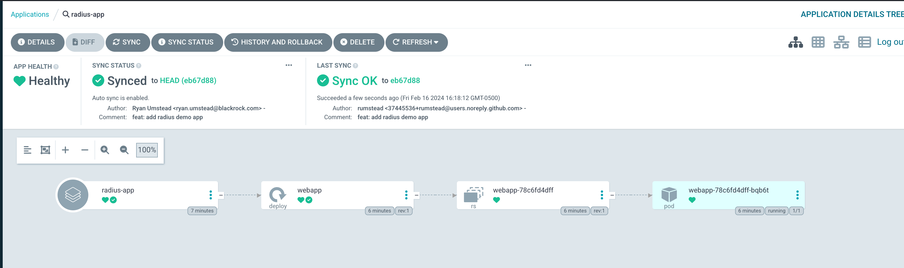

# Examples
Taken from https://docs.radapp.io/tutorials/helm/#step-4-add-radius
## Assumptions
You have a basic understanding of Argo CD, Radius, and have them both installed. 
- https://argo-cd.readthedocs.io/en/stable/#quick-start
- https://docs.radapp.io/getting-started/

### More Advanced Argo CD install
- https://github.com/rumstead/gitops-toolkit

## Commands from root of project
```shell
cd radius/demo
rad init 
kubectl create namespace demo
kubectl create secret generic --namespace demo --from-literal=url=redis://fake-server redis-secret
```
### Radius
From here, edit the helm chart to include the radius annotations.
```yaml
  annotations:
    radapp.io/enabled: 'true'
```
### Create the Argo CD application
[You can view the app here](./argocd-config/radius-app.yaml)

Assuming you deployed Argo CD into the Argo CD namespace: 
```shell
kubectl apply -f radius/argocd-config/radius-app.yaml -n argocd
```

You should now see the demo application deployed. 


### Radius picks it up
```shell
rad app graph -a demo -g default-demo
Displaying application: demo

Name: webapp (Applications.Core/containers)
Connections: (none)
Resources:
  webapp (kubernetes: apps/Deployment)


```