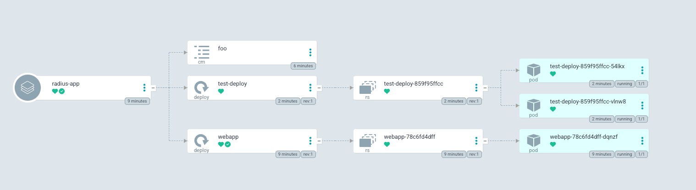
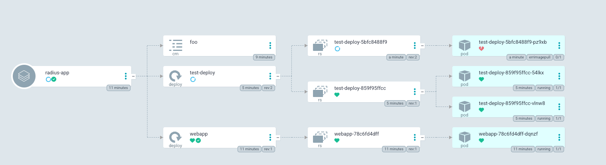

# Examples
Taken from https://docs.radapp.io/tutorials/helm/#step-4-add-radius
## Assumptions
You have a basic understanding of Argo CD, Radius, and have them both installed. 
- https://argo-cd.readthedocs.io/en/stable/#quick-start
- https://docs.radapp.io/getting-started/

### More Advanced Argo CD install
- https://github.com/rumstead/gitops-toolkit

## Commands from root of project
```shell
cd radius/demo
rad init 
kubectl create namespace demo
kubectl create secret generic --namespace demo --from-literal=url=redis://fake-server redis-secret
```
### Radius
From here, edit the helm chart to include the radius annotations.
```yaml
  annotations:
    radapp.io/enabled: 'true'
```
### Create the Argo CD application
[You can view the app here](./argocd-config/radius-app.yaml)

Assuming you deployed Argo CD into the Argo CD namespace: 
```shell
kubectl apply -f radius/argocd-config/radius-app.yaml -n argocd
```

You should now see the demo application deployed. 


### Radius picks it up
```shell
rad app graph -a demo -g default-demo
Displaying application: demo

Name: webapp (Applications.Core/containers)
Connections: (none)
Resources:
  webapp (kubernetes: apps/Deployment)

```

## Deploying Manifests outside of Argo CD but have them show in the UI
### Assumptions
You deployed Argo CD and are using the annotation or annotation+label [tracking strategies](https://argo-cd.readthedocs.io/en/stable/user-guide/resource_tracking/#additional-tracking-methods-via-an-annotation). 

https://github.com/argoproj/argo-cd/issues/8683
After the `webapp` deployment from the previous example, you can deploy the following manifest to have it show in the Argo CD UI. 
You won't have to worry about Argo CD pruning or trying to reconcile the resources. That is because the Argo CD tracking annotation from the webapp
is set on both the `foo` config map and the `test-deploy` deployment. 


### Example
In this example, everything but the webapp deployment and its child resources were applied outside the argo cd application.
E.g, the `foo config map` and the `test-deploy deployment` (I pride myself on my creative naming).

#### Happy Deployment


#### Sad Deployment
